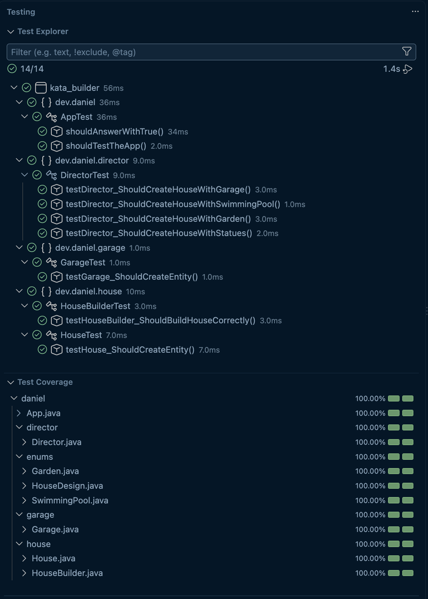

# Exercise Java Degign Patterns - House Builder

✅ Exercise completed


## Description 

> A simple exercise for understanding and using Builder pattern with a task of creating different variants of one entity "House". 
> Instructions of exercise: [LINK](https://github.com/danielmuntyanu/ex-java-design_patterns-house_builder/blob/main/README.md)

## Class Diagram

```mermaid
---
title: Class Diagram
config:
  theme: neo-dark
---
classDiagram
    class IBuilder {
        <<interface>>
        +getResult() House
        +setPrice(price BigDecimal) 
        +setArea(area float) 
        +setFloors(floors int) 
        +setColor(color String) 
        +setDesign(design HouseDesign) 
        +setGarage(garage Garage) 
        +setGarden(garden Garden) 
        +setSwimmingPool(swimmingPool SwimmingPool) 
        +setStatues(statues int) 
    }

    class HouseBuilder {
        -price BigDecimal
        -area float
        -floors int
        -design HouseDesign
        -color String
        -garden Garden
        -swimmingPool SwimmingPool
        -statues int
        -garage Garage
        +getResult() House
        +setPrice(price BigDecimal) 
        +setArea(area float) 
        +setFloors(floors int) 
        +setColor(color String) 
        +setDesign(design HouseDesign) 
        +setGarage(garage Garage) 
        +setGarden(garden Garden) 
        +setSwimmingPool(swimmingPool SwimmingPool) 
        +setStatues(statues int) 
    }

    class House {
        -price BigDecimal
        -area float
        -floors int
        -design HouseDesign
        -color String
        -garden Garden
        -swimmingPool SwimmingPool
        -statues int
        -garage Garage
        +House(floors int , color String, design HouseDesign, area float, price BigDecimal, swimmingPool SwimmingPool,
            garden Garden, statues int, garage Garage) House
        +getPrice() BigDecimal
        +getArea() float
        +getFloors() int
        +getColor() String
        +getDesign() HouseDesign
        +getGarage() Garage
        +getGarden() Garden
        +getSwimmingPool() SwimmingPool
        +getStatues() int
    }

    class InterfaceDirector {
        <<interface>>
        +constructHouseWithGarage(builder IBuilder) House
        +constructHouseWithFancyStatues(builder IBuilder) House
        +constructHouseWithSwimmingPool(builder IBuilder) House
        +constructHouseWithGarden(builder IBuilder) House
    }

    class Director {
        +constructHouseWithGarage(builder IBuilder) House
        +constructHouseWithFancyStatues(builder IBuilder) House
        +constructHouseWithSwimmingPool(builder IBuilder) House
        +constructHouseWithGarden(builder IBuilder) House
    }

    class Garage {
        -area float
        -spaces int
        -passageIntoHouse boolean
        +Garage(area float, spaces int, passageIntoHouse boolean) Garage
        +getArea() float
        +getSpaces() int
        +isPassageIntoHouse() boolean
    }

    class SwimmingPool {
        <<enum>>
        SMALL
        BIG
        MEDIUM
    }

    class Garden {
        <<enum>>
        FULL
        FLOWERS
        TREES
    }

    class HouseDesign {
        <<enum>>
        RANCH
        MODERN
        SPANISH
        TUDOR
        GEORGIAN
    }

    Director ..|> InterfaceDirector
    HouseBuilder ..|> IBuilder
    Director ..> IBuilder : uses
    HouseBuilder ..> House : creates
    
    House *-- Garage
    House --> Garden
    House --> SwimmingPool
    House --> HouseDesign
```

## Testing

